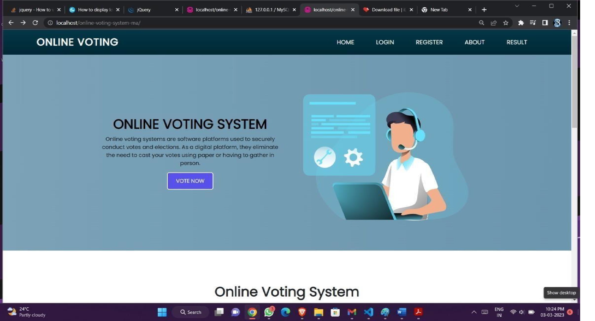
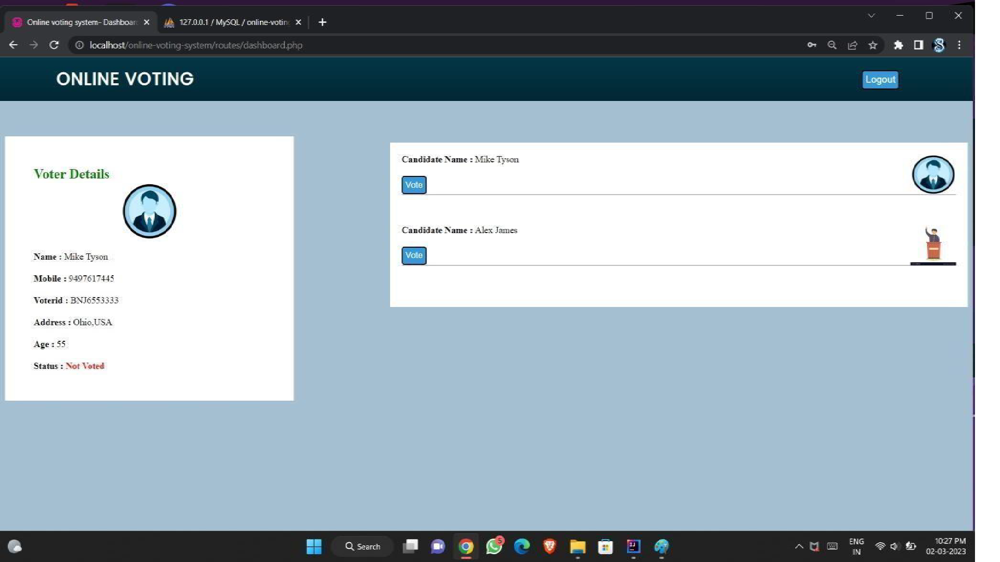

# Online Voting System (OVS)

This project is a secure web-based Online Voting System designed for college elections.  
It enables students to cast their votes digitally without visiting the campus, making the election process faster and more accessible.  
The system was developed using PHP, MySQL, HTML, CSS, JavaScript, jQuery, and Apache, as part of the BCA Mini Project at Mar Augusthinose College.

---

## Features

### User and Candidate Management
- Student and candidate registration  
- Login authentication  
- Update personal information  
- ID and photo upload  

### Voting Module
- Secure vote casting  
- Ensures each student votes only once  
- Votes stored safely in the database  
- Duplicate or invalid voting prevented  

### Election Management
- Candidate listing  
- Vote counting  
- Display of election results  
- Dashboard with user and candidate information  
(Referenced from the screenshots in the project report)

### Additional Features
- User-friendly interface  
- Fast vote processing  
- Accurate and reliable data handling  
- Supports multiple users at the same time  
- Simple navigation between pages

---

## Tech Stack

| Component | Technology |
|----------|------------|
| Frontend | HTML, CSS, JavaScript, jQuery |
| Backend | PHP |
| Database | MySQL |
| Server | Apache (XAMPP/WAMP) |

---

## Modules

### Candidate Module
- Registration  
- Login  
- Profile management  
- Participation in elections  

### User (Voter) Module
- Registration  
- Login  
- Voter dashboard  
- Cast vote  
- View election results  

---

## Testing
The system underwent:
- Unit testing  
- Integration testing  
- Validation testing  
- System testing  

Each test ensured correct functionality across different inputs and user interactions.

---

## Requirements
- Web browser (Chrome, Firefox, Edge)  
- PHP 7+  
- MySQL  
- Apache Server (WAMP/XAMPP)  
- Code Editor (e.g., VS Code, Dreamweaver)

---

## Screenshots

### Home Page

### Login Page

### Registration Page

### Dashboard

### Results Page

---

## Future Scope
- Stronger security and privacy enhancements  
- Improved protection against malware and fraud  
- Possibility of integrating cryptographic, verifiable voting systems in future versions  

---

## Conclusion
This online voting system provides a modern alternative to traditional manual voting.  
It improves accessibility, reduces errors, and produces faster results, making it a more efficient solution for college elections.
